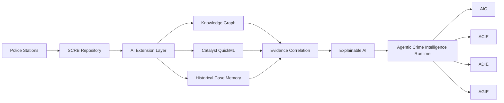
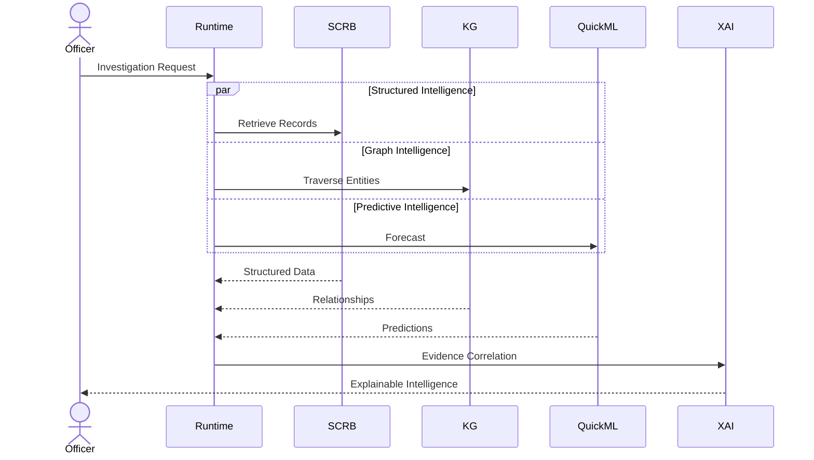
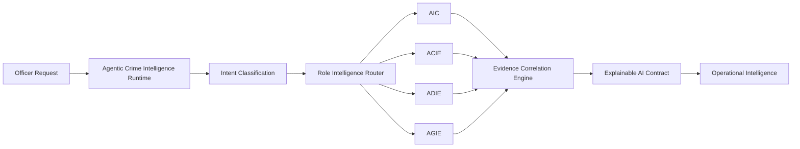
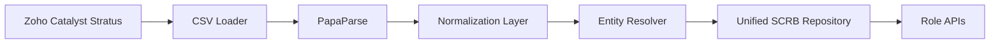
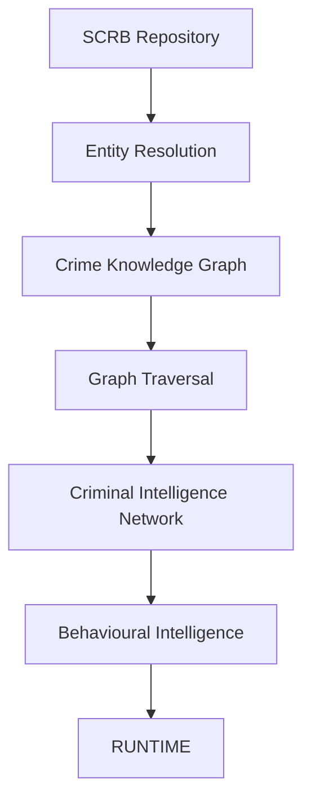
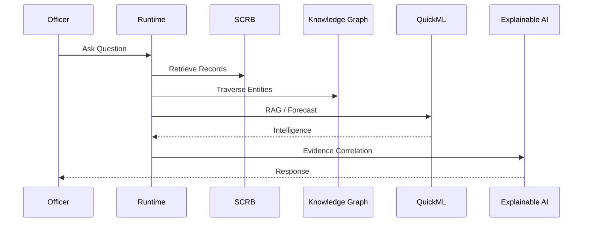
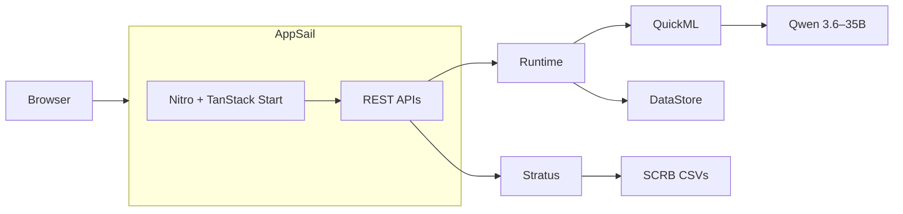
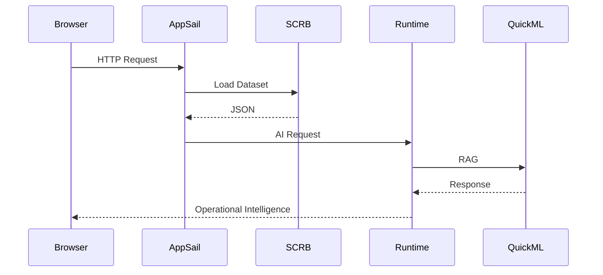

<div align="center">

# C.O.R.T.E.X.
## Crime Operational Reasoning & Tactical Execution

### An Agentic Crime Intelligence Platform for the Karnataka State Police

---


---

###  Karnataka State Police Datathon 2026

### Track 1 — Intelligent Conversational AI for KSP Crime Database

---

*"One SCRB Repository. Four Intelligence Engines. One Unified Operational Platform."*

</div>

---

# Overview

Modern policing generates enormous amounts of structured information—from FIRs, accused records, arrests, victims, charge sheets, legal sections, court proceedings, police units, and district-level intelligence. Although this information exists within the State Crime Records Bureau (SCRB), officers across different operational roles require fundamentally different forms of intelligence.

An investigator requires evidence correlation.

A crime analyst requires pattern discovery.

A supervisory officer requires operational recommendations.

A policymaker requires statewide governance intelligence.

Today's systems expose the **same database** to every user.

**CORTEX transforms the same SCRB repository into four role-aware intelligence experiences through an Agentic Crime Intelligence Runtime.**

---

# Problem Statement

The Karnataka State Police maintains vast structured crime repositories containing operationally valuable information. However,

- Information exists across multiple relational tables.
- Cross-case relationships remain difficult to discover.
- Officers manually correlate entities.
- Existing systems provide retrieval rather than intelligence.
- Different operational roles consume identical datasets despite requiring different decision support.

Traditional keyword search cannot answer questions like:

> "Show suspects connected to vehicle KA01AB1234 across districts."

> "Generate an operational deployment plan for tomorrow's public gathering."

> "Identify emerging burglary hotspots over the last 90 days."

These require reasoning—not simple database queries.

---

# Solution

CORTEX introduces an **Agentic Crime Intelligence Platform** that augments the existing SCRB infrastructure without modifying operational police workflows.

Instead of replacing existing systems, CORTEX introduces an intelligence layer capable of:

- Conversational Crime Intelligence
- Entity Correlation
- Knowledge Graph Traversal
- Explainable Reasoning
- Predictive Analytics
- Role-aware Operational Decision Support

Every recommendation is backed by evidence, confidence scores, reasoning traces, and source attribution.

---

# Why CORTEX?

Unlike conventional conversational AI systems, CORTEX does **not** use a single generic assistant.

It dynamically initializes one of four specialized intelligence runtimes.

| Runtime | Primary User | Objective |
|----------|--------------|-----------|
| **AIC** | Investigator | Investigation Assistance |
| **ACIE** | Crime Analyst | Crime Intelligence & Forecasting |
| **ADIE** | Supervisor | Operational Decision Support |
| **AGIE** | Policymaker | Strategic Governance Intelligence |

The same SCRB repository therefore produces completely different intelligence depending on operational context.

---

# Core Capabilities

### 🧠 Agentic Crime Intelligence Runtime

A centralized orchestration engine that performs planning, retrieval, memory, reasoning, and tool execution before generating operational intelligence.

---

### 🔍 Conversational Investigation

Investigators interact with structured crime records using natural language instead of SQL queries or keyword search.

---

### 🕸 Criminal Intelligence Network (CIN)

Constructs dynamic relationship graphs between

- Persons
- Vehicles
- Phone Numbers
- Addresses
- Criminal Cases
- Organizations

to expose hidden criminal relationships.

---

### 📊 Predictive Crime Intelligence

Catalyst QuickML pipelines generate

- Crime Forecasting
- Pattern Detection
- Emerging Hotspots
- Risk Scoring

using historical SCRB datasets.

---

### 📑 Explainable AI

Every AI response follows an explainability contract.

```json
{
  "answer": "...",
  "reasoning": "...",
  "evidence": [],
  "confidence": 0.94,
  "sources": []
}
```

No recommendation is generated without evidence.

---

# Key Highlights

- Role-aware conversational AI over structured police databases.
- Live SCRB data integration through Zoho Catalyst Stratus.
- Agentic reasoning powered by Qwen 3.6–35B.
- Criminal Intelligence Network for relationship discovery.
- Explainable AI with evidence attribution.
- Catalyst QuickML powered predictive intelligence.
- Production-ready deployment on Zoho Catalyst AppSail.

---

# System Overview

```text
Police Stations
        │
        ▼
 SCRB Repository
        │
        ▼
 AI Extension Layer
        │
        ▼
 Criminal Intelligence Network
        │
        ▼
 Agentic Crime Intelligence Runtime
        │
        ▼
 Explainable Operational Intelligence
        │
        ▼
Role-aware Decision Support
```

---

# High-Level Architecture



---

# Runtime Request Flow



---

# Technology Stack

| Layer | Technology | Purpose |
|-------|------------|---------|
| Framework | React 19 + TanStack Start | Full-stack SSR Application |
| Runtime | Node.js 20 | Catalyst AppSail Runtime |
| Styling | Tailwind CSS v4 | Government Command Center UI |
| Maps | Leaflet + OpenStreetMap | GIS Visualization |
| Graphs | Cytoscape.js | Criminal Intelligence Network |
| Charts | Apache ECharts | Operational Analytics |
| AI | Zoho Catalyst QuickML + Qwen 3.6–35B | Conversational Reasoning |
| Storage | Zoho Catalyst Stratus | SCRB Dataset Storage |
| Backend | Catalyst Serverless Functions | Agent Runtime |
| Deployment | Catalyst AppSail | Production Hosting |

---

# Repository Structure

*(Detailed project structure is covered in Part 3.)*

---
# Agentic Crime Intelligence Runtime

Unlike traditional conversational AI systems that follow a simple **Retrieve → Generate** workflow, CORTEX introduces an **Agentic Crime Intelligence Runtime** capable of planning, orchestrating, and reasoning over multiple intelligence sources before generating a response.

The runtime is deployed as a **Zoho Catalyst Serverless Function** and acts as the centralized orchestration layer for every workspace.

Its responsibilities include:

- Intent Classification
- Role-aware Runtime Selection
- Context Retrieval
- Entity Correlation
- Knowledge Graph Traversal
- QuickML Inference
- Explainable Response Generation

---

## Runtime Architecture



---

# Role-Aware Intelligence Engines

## AIC — Adaptive Investigation Companion

Designed specifically for investigating officers.

Capabilities include:

- Natural Language Investigation
- Criminal Intelligence Network Exploration
- Behavioural Intelligence Profile Generation
- Investigation Timeline Construction
- Evidence Correlation
- Voice-assisted Investigation

Every response contains:

- Answer
- Reasoning
- Supporting Evidence
- Confidence Score
- Source References

---

## ACIE — Adaptive Crime Intelligence Engine

Supports Crime Analysts.

Primary responsibilities include:

- Crime Trend Analysis
- District Intelligence
- Crime Heatmaps
- Hotspot Detection
- Criminal Network Analytics
- Predictive Crime Forecasting

Powered by Catalyst QuickML Forecast Pipelines.

---

## ADIE — Adaptive Decision Intelligence Engine

Supports supervisory officers.

Provides:

- Operational Briefs
- Threat Assessment
- Deployment Recommendations
- Resource Planning
- Tactical Timelines

Designed for district-level operational command.

---

## AGIE — Adaptive Governance Intelligence Engine

Designed for strategic decision makers.

Capabilities:

- Statewide Crime KPIs
- Policy Simulation
- Executive Intelligence
- District Comparison
- Governance Reporting
- Long-term Strategic Planning

---

# Explainable AI Contract

Every AI response generated by CORTEX follows a structured explainability schema.

```json
{
  "answer": "...",
  "reasoning": "...",
  "confidence": 0.94,
  "evidence": [],
  "sources": []
}
```

Unlike conventional LLM assistants, CORTEX never produces unsupported recommendations.

Every response is evidence-backed.

---

# SCRB Data Intelligence Layer

CORTEX does **not** replace the existing SCRB infrastructure.

Instead, it augments it through an intelligence layer.

Current SCRB datasets are hosted inside **Zoho Catalyst Stratus** and fetched dynamically at runtime.

### Imported Datasets

- ACCUSED
- ACT
- ARREST
- CHARGESHEET
- COMPLAINANT
- COURT
- CRIMEHEAD
- CRIMESUBHEAD
- DISTRICT
- EMPLOYEE
- SECTION
- UNIT
- VICTIM

---

## Data Normalization Pipeline



---

The normalization layer performs:

- Type Conversion
- Foreign-Key Resolution
- District Mapping
- Entity Correlation
- Helper Method Generation

This allows the application to expose a unified investigation model despite the relational nature of the SCRB schema.

---

# AI Extension Layer

One of the key architectural innovations of CORTEX is the **AI Extension Layer**.

Rather than modifying operational SCRB tables, CORTEX builds an independent intelligence schema that enables advanced reasoning.

### Entity Types

- PersonMaster
- VehicleMaster
- PhoneMaster
- AddressMaster
- BankMaster
- GangMaster
- Digital Evidence

These entities power cross-case identity resolution and criminal relationship discovery while preserving the integrity of the original SCRB database.

---

# Criminal Intelligence Network (CIN)

The Criminal Intelligence Network is a graph-native representation of crime entities.

Instead of treating crime records as isolated rows, CORTEX transforms them into an interconnected graph.

## Nodes

- Persons
- Cases
- Vehicles
- Phones
- Addresses
- Police Units
- Districts

## Relationships

- Accused In
- Victim Of
- Uses Phone
- Owns Vehicle
- Lives At
- Investigated By
- Associated With

---

## Knowledge Graph Pipeline



---

The graph enables:

- Cross-case relationship discovery
- Hidden accomplice detection
- Behavioural profiling
- Timeline reconstruction
- Multi-hop investigation queries

---

# Catalyst QuickML Pipelines

CORTEX integrates two independent QuickML pipelines.

---

## Pipeline 1

### Conversational Intelligence

**Endpoint**

```
POST /chat
```

Powered by

**Zoho Catalyst QuickML RAG**

Hosted Model

**Qwen 3.6 – 35B**

Knowledge Base includes:

- SOPs
- Investigation Manuals
- Cyber Forensics
- Bharatiya Nyaya Sanhita
- NDPS
- FIR Summaries
- Governance Documents

Pipeline Responsibilities

- Conversational Investigation
- Legal Guidance
- Explainable Q&A
- Evidence Grounding
- Image-assisted Investigation (VLM)

---

## Pipeline 2

### Crime Forecast Intelligence

Endpoints

```
GET /pattern

GET /report
```

QuickML Regression Pipeline

Input

```
historic_case_count
```

Outputs

- Crime Forecast
- Trend Prediction
- Emerging Hotspots
- Operational Risk

---

## AI Request Flow



---

# REST API

## Investigation

```
GET /api/cases

GET /api/case/:id

GET /api/case/:id/timeline

GET /api/case/:id/cin

GET /api/case/:id/bip

POST /api/chat
```

---

## Crime Analytics

```
GET /api/intelligence/dashboard

GET /api/network

GET /api/pattern

GET /api/report
```

---

## Supervisor

```
GET /api/operations

GET /api/deployment

GET /api/orders

GET /api/threats
```

---

## Governance

```
GET /api/governance/dashboard

GET /api/policy-impact

GET /api/resource-planning

GET /api/policy-simulation
```

---

# Why Agentic AI Instead of Traditional RAG?

Traditional conversational systems follow a simple pipeline.

```text
User
   │
Retrieve
   │
LLM
   │
Answer
```

CORTEX follows a multi-stage reasoning architecture.

```text
Officer Request
        │
Intent Classification
        │
Role Intelligence Router
        │
SCRB Retrieval
Knowledge Graph Traversal
QuickML Prediction
Historical Context
        │
Evidence Correlation
        │
Explainable AI
        │
Operational Intelligence
```

This architecture enables explainable, evidence-backed, and role-aware intelligence rather than generic chatbot responses.

---

# Project Structure

```text
CORTEX/
│
├── public/
│   ├── assets/
│   ├── icons/
│   └── images/
│
├── src/
│   ├── components/
│   │   ├── common/
│   │   ├── charts/
│   │   ├── maps/
│   │   ├── graph/
│   │   └── ui/
│   │
│   ├── routes/
│   │   ├── investigator/
│   │   ├── analyst/
│   │   ├── supervisor/
│   │   ├── policymaker/
│   │   └── api/
│   │
│   ├── services/
│   │   ├── scrb.ts
│   │   ├── analytics.ts
│   │   ├── graph.ts
│   │   └── runtime.ts
│   │
│   ├── hooks/
│   ├── lib/
│   ├── utils/
│   ├── styles/
│   └── types/
│
├── server/
│   └── index.mjs
│
├── functions/
│   └── cortex_runtime/
│
├── README.md
└── package.json
```

---

# Local Development

## Clone Repository

```bash
git clone https://github.com/<username>/CORTEX.git

cd CORTEX
```

---

## Install Dependencies

```bash
npm install
```

---

## Run Development Server

```bash
npm run dev
```

Application starts at

```
http://localhost:3000
```

---

# Environment Variables

Create

```
.env
```

```env
SCRB_BUCKET_URL=https://imports2-development.zohostratus.in

CORTEX_RUNTIME_URL=https://cortex-60080078691.development.catalystserverless.in/server/cortex_runtime

PORT=3000
```

---

# Production Deployment

CORTEX is designed for deployment entirely on **Zoho Catalyst**.

Deployment consists of:

- Catalyst AppSail
- Catalyst Stratus
- Catalyst Serverless Functions
- Catalyst QuickML
- Catalyst Cache
- Catalyst Signals

No third-party backend services are required.

---

## Production Architecture



---

## Runtime Lifecycle



---

# Performance

Current MVP performance measured on Catalyst deployment.

| Metric | Value |
|----------|-------|
| SCRB Datasets | 13 |
| Normalized Entities | Live Runtime |
| Initial Data Load | < 2 sec |
| Dashboard Load | < 1.5 sec |
| REST API Response | 200–500 ms |
| Runtime Response | 2–5 sec |
| Voice Capture | Real-time |
| Explainability Coverage | 100% |

---

# Screenshots

## Landing Page

> *Insert Screenshot*

---

## Mission Console

> *Insert Screenshot*

---

## Adaptive Investigation Companion

> *Insert Screenshot*

---

## Adaptive Crime Intelligence Engine

> *Insert Screenshot*

---

## Adaptive Decision Intelligence Engine

> *Insert Screenshot*

---

## Adaptive Governance Intelligence Engine

> *Insert Screenshot*

---

## Criminal Intelligence Network

> *Insert Screenshot*

---

## Architecture

> *Insert Screenshot*

---

# Security

CORTEX follows a layered security model.

- Role-based Workspace Isolation
- API Gateway
- Server-side AI Requests
- Runtime Authentication
- Explainable AI Logging
- Evidence-backed Responses
- Audit-ready Intelligence

Future work includes

- ABAC
- RBAC
- Audit Trails
- Immutable Investigation Logs

---

# Scalability

The architecture is designed to scale horizontally.

Current

```
SCRB CSVs
```

↓

Future

```
Catalyst Data Store

↓

Knowledge Graph Database

↓

Streaming Event Processing

↓

Real-time Intelligence
```

No application changes are required.

---

# Future Roadmap

## Phase 1

- Live SCRB Integration
- Conversational Investigation
- Role-aware Runtime
- Knowledge Graph
- Explainable AI

---

## Phase 2

- QuickML Production Models
- Historical Forecasting
- Entity Resolution Engine
- Criminal Intelligence Network
- Behaviour Profiling

---

## Phase 3

- OCR
- Face Matching
- Vehicle Recognition
- Mobile Companion
- Real-time Event Intelligence
- Predictive Policing
- Multi-language Investigation

---

# Why CORTEX?

Unlike traditional police software,

CORTEX is not another dashboard.

It is an **Agentic Crime Intelligence Platform**.

Traditional Systems

```
Search

↓

View Record

↓

Manual Investigation
```

CORTEX

```
Officer Query

↓

Intent Classification

↓

Role Runtime

↓

SCRB Retrieval

↓

Knowledge Graph

↓

QuickML

↓

Evidence Correlation

↓

Explainable AI

↓

Operational Intelligence
```

---

# Built With

- React 19
- TanStack Start
- TypeScript
- Tailwind CSS
- Apache ECharts
- Cytoscape.js
- Leaflet
- PapaParse
- Zoho Catalyst
- Catalyst AppSail
- Catalyst Stratus
- Catalyst Serverless Functions
- Catalyst QuickML
- Qwen 3.6–35B
- Web Speech API

---

# Contributors

## Team Corsair Devs

**Karnataka State Police Datathon 2026**

Track 1

**Intelligent Conversational AI for KSP Crime Database**

---

# Acknowledgements

Special thanks to

- Karnataka State Police
- State Crime Records Bureau
- Zoho Catalyst
- QuickML Team
- OpenStreetMap
- Apache ECharts
- Cytoscape.js Community

---

# License

This project has been developed exclusively for the **Karnataka State Police Datathon 2026**.

© 2026 Team Corsair Devs.

All Rights Reserved.

---

<div align="center">

## C.O.R.T.E.X.

### Crime Operational Reasoning & Tactical Execution

**One SCRB Repository • Four Intelligence Engines • Explainable Operational Intelligence**

⭐ If you found this project interesting, consider giving the repository a star.

</div>
